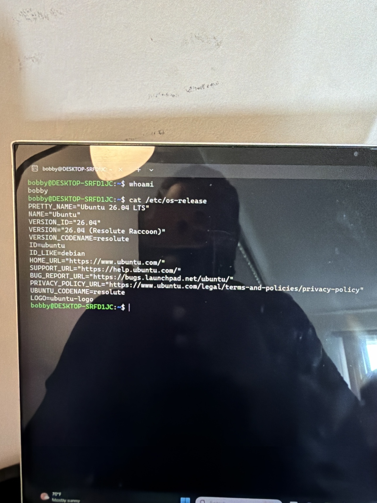
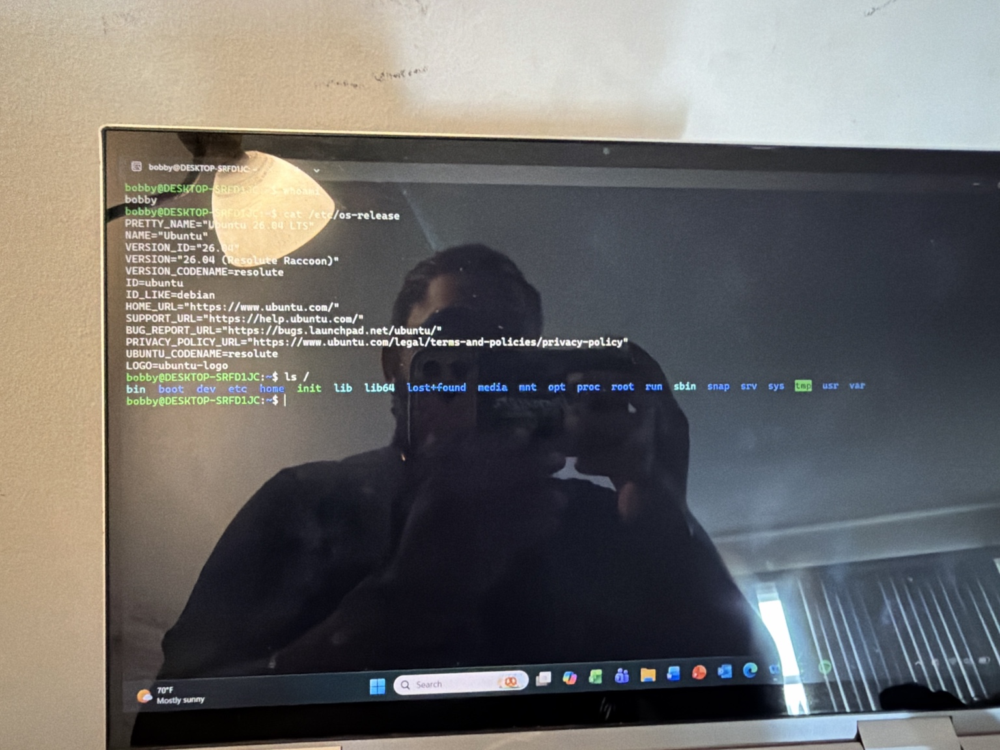
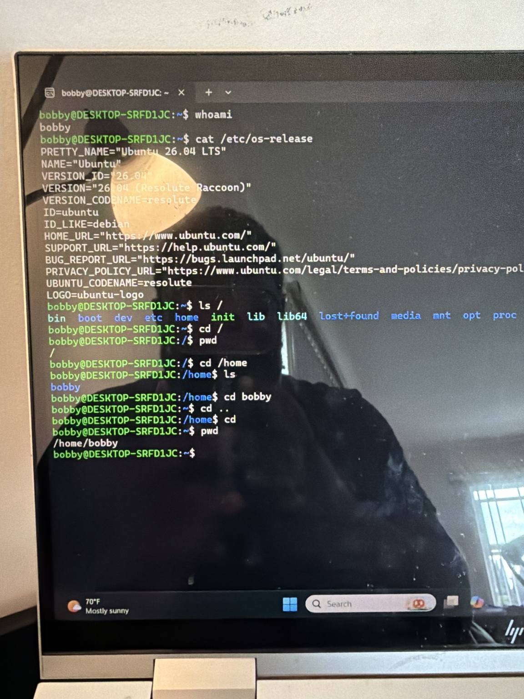
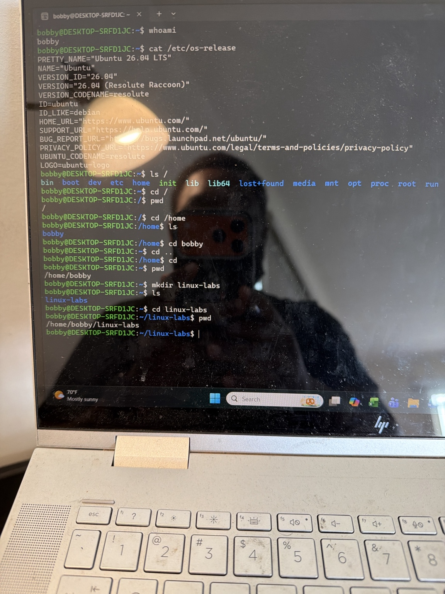
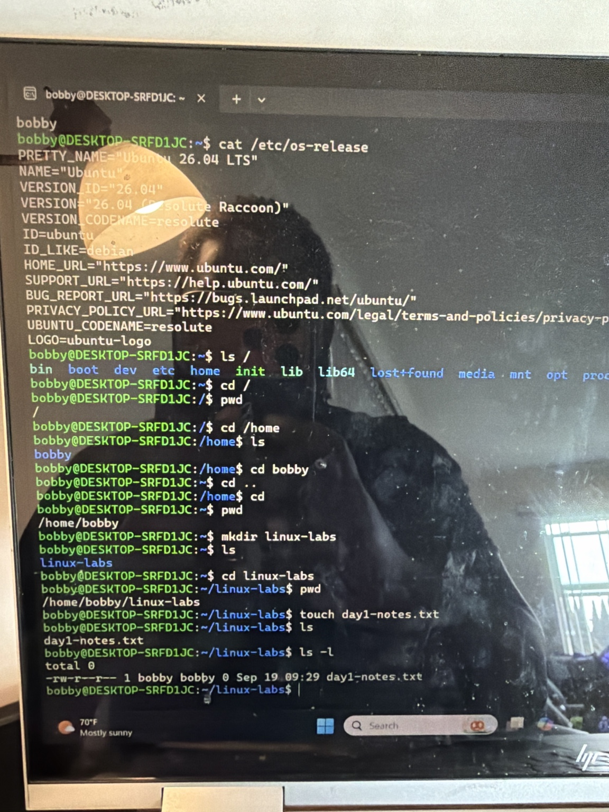
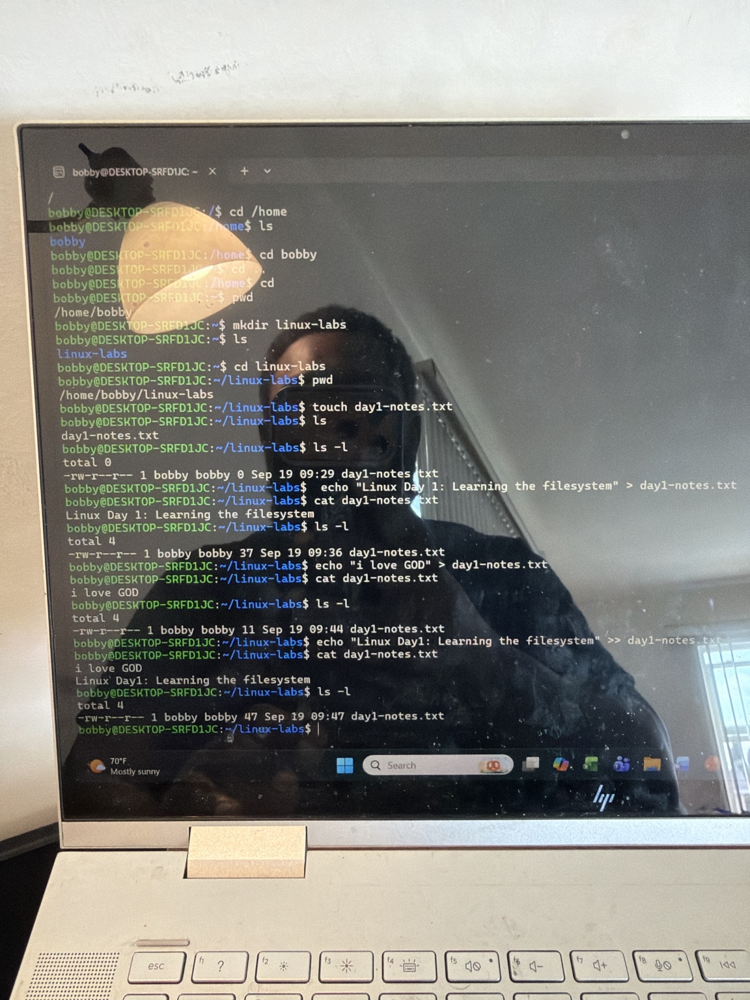

# Linux Day 1: Foundations, Navigation, and Basic File Management

## Overview

This lab documents my first structured Linux administration session using Ubuntu 26.04 LTS through Windows Subsystem for Linux (WSL). The goal was to understand the Linux terminal, explore the filesystem, navigate between directories, and create and modify files safely.

## Lab Environment

- Host operating system: Windows
- Linux environment: Ubuntu 26.04 LTS (Resolute Raccoon)
- Platform: Windows Subsystem for Linux (WSL)
- Shell user: `bobby`
- Lab workspace: `/home/bobby/linux-labs`

> Security note: Screenshots used in this project do not contain passwords, access keys, or other authentication secrets.

## Learning Objectives

- Understand the difference between Linux, Ubuntu, the terminal, and the shell
- Identify the current user and working directory
- Understand the Linux root directory and home directory
- Navigate using absolute and relative paths
- Create directories and files
- View file details and contents
- Understand overwrite and append redirection
- Recognize and correct a basic command error

## 1. Identifying the User and Operating System

I identified the currently signed-in Linux user:

```bash
whoami
```

Output:

```text
bobby
```

I then checked the installed Linux distribution:

```bash
cat /etc/os-release
```

The output confirmed that the environment was running Ubuntu 26.04 LTS.

Key concepts:

- Linux is the kernel at the center of the operating system.
- Ubuntu is a Linux distribution containing the kernel and additional tools.
- The terminal is the window used to enter commands.
- The shell interprets commands entered in the terminal.
- WSL allows a Linux environment to run alongside Windows.

## 2. Understanding the Command Prompt

The prompt appeared in this general format:

```text
bobby@DESKTOP-SRFD1JC:~$
```

| Prompt section | Meaning |
|---|---|
| `bobby` | Current Linux user |
| `DESKTOP-SRFD1JC` | Hostname |
| `~` | Current user's home directory |
| `$` | Regular-user shell prompt |

The `~` symbol represents `/home/bobby` for this user.

## 3. Exploring the Linux Filesystem

I displayed the current working directory:

```bash
pwd
```

Output:

```text
/home/bobby
```

I listed the main directories beneath the Linux root directory:

```bash
ls /
```

Important directories introduced in this lab:

| Directory | Purpose |
|---|---|
| `/` | Top of the Linux filesystem |
| `/home` | Home directories for regular users |
| `/etc` | System and application configuration files |
| `/var` | Logs and other frequently changing data |
| `/usr` | Installed programs and shared resources |
| `/tmp` | Temporary files |
| `/mnt` | Mounted filesystems; WSL commonly exposes Windows drives here |
| `/root` | Home directory of the root administrator |

The root directory `/` and the root administrator account are different concepts.

## 4. Navigating Between Directories

I moved to the root directory and verified the location:

```bash
cd /
pwd
```

I then navigated to my home directory through `/home`:

```bash
cd /home
ls
cd bobby
```

This demonstrated two path types:

- `/home` is an **absolute path** because it starts from `/`.
- `bobby` is a **relative path** because Linux searches for it from the current directory.

I also practised special navigation shortcuts:

```bash
cd ..
cd
```

| Command or symbol | Meaning |
|---|---|
| `cd ..` | Move to the parent directory |
| `cd` | Return directly to the user's home directory |
| `.` | Current directory |
| `..` | Parent directory |
| `~` | Current user's home directory |

## 5. Creating the Lab Workspace

I created a directory for Linux practice:

```bash
mkdir linux-labs
```

I entered the new directory and verified its absolute path:

```bash
cd linux-labs
pwd
```

Output:

```text
/home/bobby/linux-labs
```

Linux filenames are case-sensitive, so `linux-labs`, `Linux-labs`, and `LINUX-LABS` could refer to different directories.

## 6. Creating and Inspecting a File

I created an empty text file:

```bash
touch day1-notes.txt
```

I verified it using both a standard and detailed listing:

```bash
ls
ls -l
```

The initial long listing showed a file size of `0` bytes because the file was empty:

```text
-rw-r--r-- 1 bobby bobby 0 Sep 19 09:29 day1-notes.txt
```

The fields displayed by `ls -l` include:

- File type and permissions
- Link count
- Owner
- Group
- Size in bytes
- Modification time
- Filename

The permission string `-rw-r--r--` indicates a regular file where the owner can read and write, while the group and other users can read.

## 7. Writing, Overwriting, and Appending Text

I wrote text into the file using output redirection:

```bash
echo "Linux Day 1: Learning the filesystem" > day1-notes.txt
```

I displayed the file contents:

```bash
cat day1-notes.txt
```

I tested the difference between the two redirection operators:

| Operator | Behavior |
|---|---|
| `>` | Replaces the existing file contents |
| `>>` | Adds new content to the end of the file |

Append example:

```bash
echo "Linux Day 1: Learning the filesystem" >> day1-notes.txt
```

After appending content, `ls -l` showed that the file size had increased, confirming that additional data had been written.

## Troubleshooting Encountered

I initially entered the Windows command:

```text
cls
```

Ubuntu returned a `command not found` message. The correct Linux command for clearing the terminal is:

```bash
clear
```

This reinforced that Windows Command Prompt and Linux shells use different commands for some tasks. It also demonstrated that a `command not found` response usually means the shell did not recognize the command; it does not automatically mean the system was damaged.

## Commands Practised

```text
whoami
pwd
ls
ls /
ls -l
cat /etc/os-release
cd /
cd /home
cd bobby
cd ..
cd
mkdir linux-labs
touch day1-notes.txt
echo "text" > day1-notes.txt
echo "text" >> day1-notes.txt
cat day1-notes.txt
clear
```

## Knowledge Check Result

I completed a five-question review covering the root directory, home-directory navigation, `pwd`, relative paths, parent-directory navigation, and redirection. I scored **4/5**. The concept requiring reinforcement was:

- `cd` returns directly to the current user's home directory.
- `cd /` moves to the top of the entire Linux filesystem.

## Screenshots

Recommended GitHub structure:

```text
01-linux-foundations/
├── README.md
└── images/
    ├── 01-user-and-ubuntu-version.jpg
    ├── 02-root-filesystem.jpg
    ├── 03-directory-navigation.jpg
    ├── 04-create-lab-directory.jpg
    ├── 05-create-and-inspect-file.jpg
    └── 06-overwrite-and-append.jpg
```

## Screenshots










## What I Learned

This lab helped me become more comfortable with the Linux terminal. I learned that the terminal is a text-based way of navigating and managing the computer, similar to performing actions in File Explorer. I can now identify my location, navigate between directories, create directories and files, inspect file information, and control whether command output replaces or appends to a file.

## Next Steps

- Copy files using `cp`
- Move and rename files using `mv`
- Remove test files and empty directories safely
- Work with hidden files
- Practise tab completion and filename patterns
- Complete an independent file-management challenge
