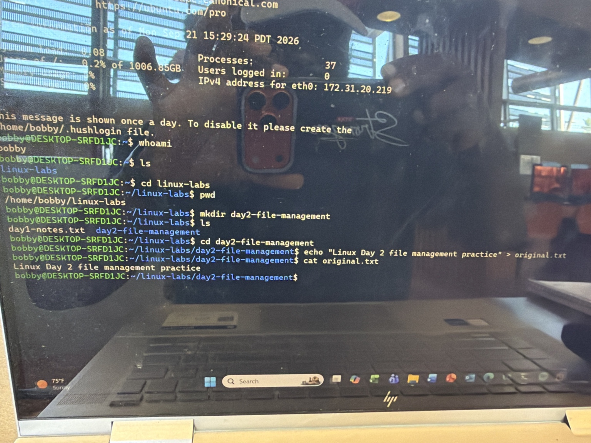
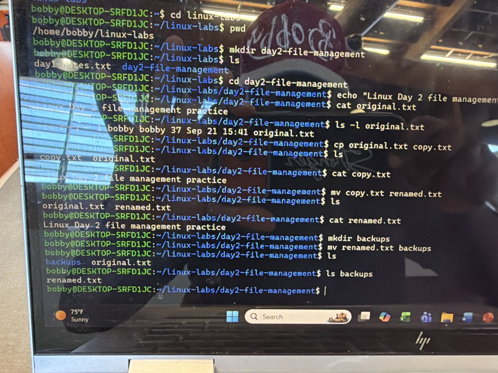
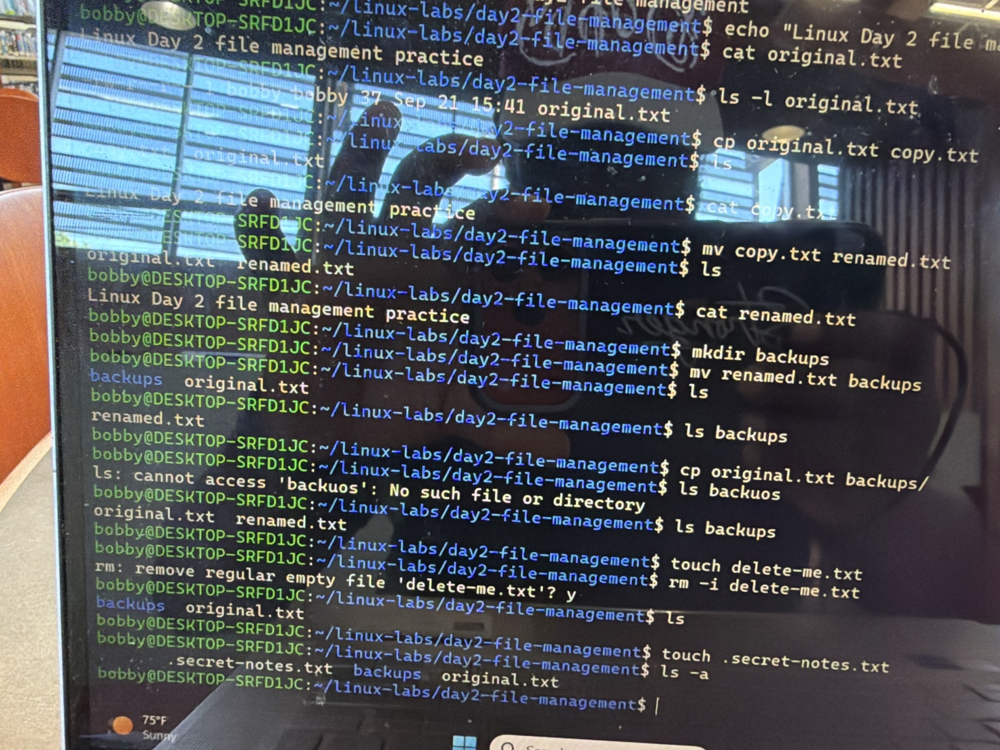
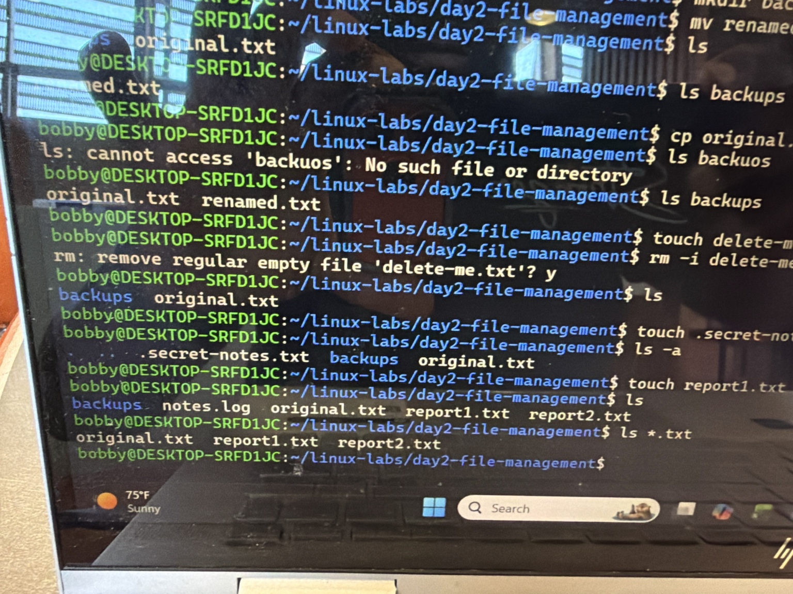
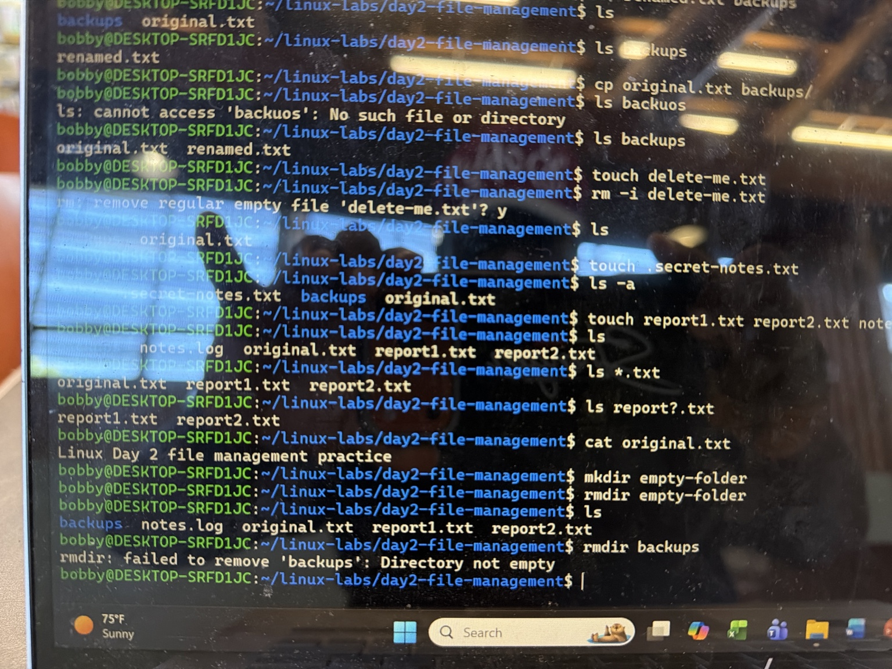
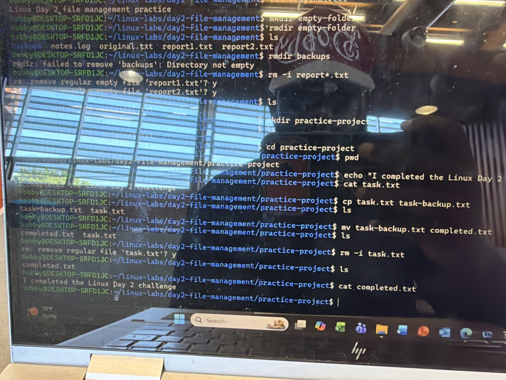

# Linux Day 2: File Management

## Lab Overview

In this lab, I practiced essential Linux file and directory management commands using Ubuntu on WSL.

## Objectives

- Create and navigate directories
- Create files and add text
- View file contents and details
- Copy, rename, move, and delete files
- Work with hidden files
- Use wildcards to select multiple files
- Safely remove files and directories

## Commands Practiced

| Command | Purpose |
|---|---|
| `pwd` | Display the current directory |
| `ls` | List visible files and directories |
| `ls -a` | Include hidden files |
| `ls -l` | Display detailed file information |
| `mkdir` | Create a directory |
| `rmdir` | Remove an empty directory |
| `touch` | Create an empty file |
| `echo` | Display text or write text to a file |
| `cat` | Display file contents |
| `cp` | Copy files |
| `mv` | Move or rename files |
| `rm -i` | Safely delete files with confirmation |

## Wildcards Practiced

- `*.txt` selects all visible files ending in `.txt`
- `report?.txt` selects files with exactly one character where `?` appears

## Key Lessons

- The `>` operator can create a file and write output into it.
- Linux hidden files begin with a period, such as `.secret-notes.txt`.
- The `mv` command can rename a file or move it to another directory.
- The `rmdir` command only removes empty directories.
- Linux filenames and commands are case-sensitive.
- Tab completion helps complete filenames and reduces typing errors.

## Challenge Completed

I created a `practice-project` directory and then:

1. Created `task.txt` with a completion message.
2. Copied it to `task-backup.txt`.
3. Renamed the copy to `completed.txt`.
4. Safely deleted the original file using `rm -i`.
5. Verified the contents of `completed.txt`.

## Result

This lab strengthened my understanding of Linux filesystem navigation and basic file-management operations used in system administration.

## Lab Evidence

### 1. Creating the Lab Directory and Original File

### 2. Copying, Renaming, and Moving Files

### 3. Safe Deletion and Hidden Files

### 4. Wildcard File Selection

### 5. Directory Removal Safety

### 6. Final Practice Challenge

